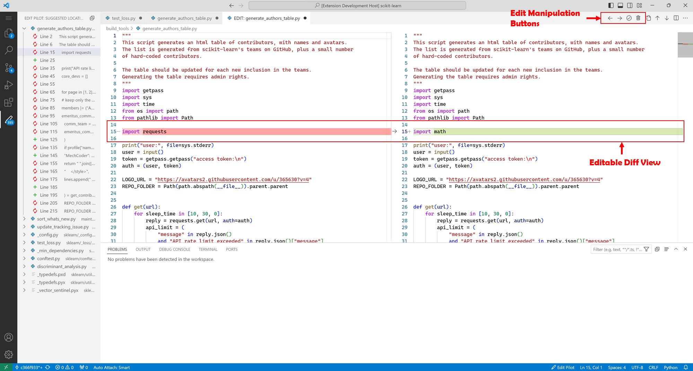

# ✏️ CoEdPilot

CoEdPilot is a Visual Studio Code extension that features automatic code edit recommendations, proposed by the paper "*CoEdPilot: Recommending Code Edits with Learned Prior Edit Relevance, Project-wise Awareness, and Interactive Nature*" by Chenyan Liu, Yufan Cai, Yun Lin, Yuhuan Huang, Yunrui Pei, Bo Jiang, Ping Yang, Jin Song Dong, and Hong Mei. Presented at ISSTA'24. 

If you are interested in the training and evaluation of the backend models, please refer to the [CoEdPilot](https://github.com/code-philia/CoEdPilot) repository.

## 🚀 Demo
> [!NOTE]
> Please click the image to watch the demo video on YouTube.

<div align="center">
   <a href="https://youtu.be/6G2-7Gf0Fhc">
   
   </a>
</div>

## ⚙️ Functionality

The extension introduces two major features: **Edit Locator** and **Edit Generator.** 

### Edit Locator

Combining a **🔍 file locator (discriminator) model** and a **🎯 line locator model.** It suggests edit locations according to *previous edits* and *current edit description.*

### Edit Generator

Based on a single **📝 generator model.** It generates replacements or insertions somewhere in the code, from suggested locations or manually selected. It also requires *previous edits* and *current edit description* and, in addition, the code to replace.

## ✨ UI

### Overview


+ Predicted locations will be displayed as a tree view in the left ⬅️ and also highlighted in the active editor
+ Query status will be displayed in the status bar ↘️
+ Edit description is accepted in the input above ⬆️

### Diff View



Once performing a prediction on a line, a diff view is shown for switching ↔️ or editing ✏️ the prediction result.

## 🧑‍💻Usage

1. Edit the code, as our extension will automatically record most previous edits.

2. Run `Predict Locations`: **right-click** anywhere in the editor and select it in the menu, or use the default keybinding `Ctrl + Alt + L` (in MacOS `Cmd + Alt + L`)

3. Run `Generate Edits`: select the code to be edited in the editor, then **right-click** and select it in the menu, or use the default keybinding `Ctrl + Alt + E` (in MacOS `Cmd + Alt + E`)

> [!NOTE]
> To select code for editing, you can:
>   * Click recommended locations in the left location list;
>   * Select part of the code for **replacing**;
>   * Select nothing to generate **insertion** code at the cursor position.
>
> And by default accepting an edit will trigger another location prediction immediately (you can change this in extension configuration).

4. Manually `Change Edit Description`: **right-click** and select it in the menu. By default the input box will automatically show at query **whenever the edit description is empty.**


5. After the model generates possible edits at that range, a difference tab with pop up for you to switch to different edits or edit the code. **There are buttons on the top right corner of the difference tab to accept, dismiss or switch among generated edits.**


## 🕹️ Run Extension

This extension is currently not released in VS Code Extension Store. Follow the next steps to run the extension in development mode in VS Code.


### 1. Run backend models

> [!NOTE]
> Always remember to start up backend models which the extension must base on.

Our model scripts require **Python 3.10** and **Pytorch with CUDA.**  

#### 1.1: Install Python dependencies

> [!IMPORTANT]
> For *Windows* and *Linux using CUDA 11.8,* please follow [PyTorch official guide](https://pytorch.org/get-started/locally/) to install PyTorch with CUDA before the following steps.

Using `pip` (with Python 3.10):

```shell
pip install -r requirements.txt
```

Or using `conda` :

```shell
conda create -n code-edit
conda activate code-edit
conda install python=3.10.13
python -m pip install -r requirements.txt
```

#### 1.2: Download models into the project directory

As mentioned before, we respectively prepared 3 models (*file locator*(including embedding model, dependency analyzer and a regression model), *line locator*, and *generator*) for each language. Supported languages are `go`, `python`, `java`, `typescript` and `javascript`.

You have 2 ways to download models. Choose one:

   * **Method 1: Use init-server script**

      Select <language> from `go`, `python`, `java`, `typescript` and `javascript` to download models for the language.

      ```bash
      python init-server.py <language>
      ```

   * **Method 2: Download manually**

      1. Download and rename **models for different languages** and **dependency analyzer** from [Huggingface Collections](https://huggingface.co/collections/code-philia/coedpilot-65ee9df1b5e3b11755547205). 
         * `dependency-analyzer/`: dependency anaylzer model, available in [Huggingface](https://huggingface.co/code-philia/dependency-analyzer);
         * `embedding_model.bin`: embedding model for file locator, available in [Huggingface](https://huggingface.co/code-philia/CoEdPilot-file-locator);
         * `reg_model.pickle`: , linear regression model, available in [Huggingface](https://huggingface.co/code-philia/CoEdPilot-file-locator);
         * `locator_model.bin`: model for line locator, available in [Huggingface](https://huggingface.co/code-philia/CoEdPilot-line-locator);
         * `generator_model.bin`: model for generator, available in [Huggingface](https://huggingface.co/code-philia/CoEdPilot-generator).

      2. To deploy models for one language, put its unzipped model folder **named with the language**.
         ```
         edit-pilot/
            models/
                  dependency-analyzer/
                  <language>/
                     embedding_model.bin
                     reg_model.pickle
                     locator_model.bin
                     generator_model.bin
         ```

#### 1.3: Start the backend

Simply run `server.py` from the project root directory

```shell
python src/model_server/server.py
```

### 2. Run extension

#### 2.1: Install Node dependencies

> [!NOTE] 
> Require Node.js (version >= 16). If Node.js not installed, please follow [Node.js official website](https://nodejs.org/en/download) to intall.

In the project root directory, install Node packages:

```shell
npm install
```

#### 2.2: Start extension using VS Code development host (in debug mode)

> [!NOTE]
> * Other extensions will be disabled in the development host.
> * Debug mode is intended for temporary testing and development purposes. If this setup meets your needs, you can start using CoEdPilot extension right away without proceeding to the next steps.
> * If you prefer long-term usage, please skip this step and refer to following steps for detailed instructions.

Open the project directory in VS Code. Press `F5`, then choose `Run Extension` if you are required to choose a configuration. A new VS Code window (the "development host") will open with CoEdPilot extension loaded. 

#### 2.3: Package extension as `.vsix`

> [!NOTE]
> You can skip [Step 2.3](#23-package-extension-as-vsix) and [Step 2.4](#24-install-extension-in-vs-code) by directly [donwloading](https://marketplace.visualstudio.com/items?itemName=CodePhilia.co-ed-pilot) the extension from VS Code Extension Store.

Make sure you have `yarn` installed.

```shell
npm install -g yarn
npm install -g vsce
```

Execute the following command in the project root directory:

```shell
yarn package
```

This command will generate a `.vsix` file in the project root directory, based on the `package.json` file.

#### 2.4: Install extension in VS Code

Open the VS Code command palette (`Ctrl + Shift + P` / `Cmd + Shift + P`), then select `Extensions: Install from VSIX...` and choose the `.vsix` file generated in the previous step.

## 🛠️ Advanced Deployment

We recommend to try this extension with backend deployed locally. This will require **CUDA** and **~4GB** video memory. But deploying backend remotely is also easy, since key is to match extension configuration of VS Code and the server listening configuration. 

By default `server.py` fetches configuration from `server.ini` then listens to `0.0.0.0:5001`. The extension client sends requests to `coEdPilot.queryUrl`, by default `http://localhost:5001`.

For basic remote backend deployment:

+ On the backend machine, confirm the IP on LAN/WAN, and open up a port through firewall.
+ Use that port in `server.ini` then run the backend `server.py`.
+ When using the extension, set `coEdPilot.queryUrl` in VS Code settings (press `Ctrl + ,` then search) to the proper connectable IP of the server.

## 🐳 Deploy Backend Models with Docker

> [!IMPORTANT]
>   * This deployment method is not fully tested. Please feel free to raise issues if you encounter any problems.
>   * MacOS is unable to use MPS acceleration via Docker, hence the following instructions are not applicable to MacOS.

You can create a Docker image and start a Docker container according to the following steps to isolate the environment and simplify the backend model deployment.

1. Navigate to the root directory of the CoEdPilot-extension project.

2. Create the Docker image (For Linux / Windows with WSL):

   ```bash
   docker build -t coedpilot-extension --build-arg MIRROR_SOURCE=<MIRROR_SOURCE> --build-arg LANG=<LANG> .
   ```

   This command supports two `build-arg` parameters:

   - `MIRROR_SOURCE`: Specifies the mirror source for installing Python dependencies, e.g., `--build-arg MIRROR_SOURCE=https://pypi.tuna.tsinghua.edu.cn/simple`. If this argument is not provided, the mirror source will not be used for installing Python dependencies.
   - `LANG`: Specifies the model for different languages, e.g., `--build-arg LANG=javascript`. The supported languages are go, python, java, typescript, and javascript. If this argument is not provided, the default model language will be Python.

3. Start the Docker container without GPU acceleration (Not recommended 👎):

   ```bash
   docker run -p 5003:5003 coedpilot-extension
   ```

4. Start the Docker container with GPU acceleration (Recommended 👍):
   * Your system **must have an NVIDIA GPU** with the **correct drivers installed**.
   * Install the [NVIDIA Container Toolkit](https://learn.microsoft.com/en-us/windows/wsl/tutorials/gpu-compute).

   and then start the Docker container with the following command:

   ```bash
   docker run --gpus all --shm-size=1g --ulimit memlock=-1 --ulimit stack=67108864 -p 5003:5003 coedpilot-extension
   ```

Now, the backend model is up and running. You can proceed to run the extension to use CoEdPilot-Extension.

After the usage, you may follow the following command to stop and remove the Docker container and image.

5. ⚠️ Stop the Docker container:

   ```bash
   docker stop $(docker ps -a -q --filter ancestor=coedpilot-extension)
   ```

   This command stops all running containers based on the `coedpilot-extension` image.

6. ⚠️ Remove the Docker container:

   ```bash
   docker rm $(docker ps -a -q --filter ancestor=coedpilot-extension)
   ```

7. ⚠️ Remove the Docker image:

   ```bash
   docker rmi coedpilot-extension
   ```

## ❓ Issues

The project is still in development, not fully tested on different platforms. 

Welcome to propose issues or contribute to the code.

**😄 Enjoy coding!**
